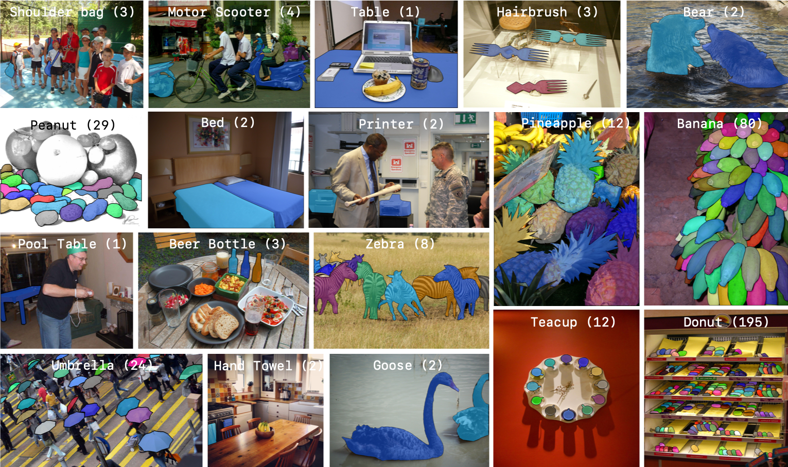

#  LVIS API


LVIS (pronounced ‘el-vis’): is a new dataset for Large Vocabulary Instance Segmentation.
When complete, it will feature more than 2 million high-quality instance segmentation masks for over 1200 entry-level object categories in 164k images. The LVIS API enables reading and interacting with annotation files, visualizing annotations, and evaluating results.



## LVIS v0.5

LVIS v0.5 marks the halfway point in data collection. For this release, we have annotated an additional 82k images (57k train, 20k test, 5k val). Release v0.5 is publicly available at [LVIS website](http://www.lvisdataset.org) and will be used in the first LVIS Challenge to be held in conjunction with the COCO Workshop at ICCV 2019.

## Setup
You can setup a virtual environment and then install `lvisapi` using pip:

```bash
python3 -m venv env               # Create a virtual environment
source env/bin/activate           # Activate virtual environment

# install COCO API. COCO API requires numpy to install. Ensure that you installed numpy.
pip install 'git+https://github.com/cocodataset/cocoapi.git#subdirectory=PythonAPI'
# install LVIS API
pip install lvis
# Work for a while ...
deactivate  # Exit virtual environment
```

You can also clone the repo first and then do the following steps inside the repo:
```bash
python3 -m venv env               # Create a virtual environment
source env/bin/activate           # Activate virtual environment

# install COCO API. COCO API requires numpy to install. Ensure that you installed numpy.
pip install 'git+https://github.com/cocodataset/cocoapi.git#subdirectory=PythonAPI'
# install LVIS API
pip install .
# test if the installation was correct
python test.py
# Work for a while ...
deactivate  # Exit virtual environment
```
## Citing LVIS

If you find this code/data useful in your research then please cite our [paper](http://www.lvisdataset.org/assets/lvis_v0.5.pdf):
```
@inproceedings{gupta2019lvis,
  title={{LVIS}: A Dataset for Large Vocabulary Instance Segmentation},
  author={Gupta, Agrim and Dollar, Piotr and Girshick, Ross},
  booktitle={Proceedings of the {IEEE} Conference on Computer Vision and Pattern Recognition},
  year={2019}
}
```

## Credit

The code is a re-write of PythonAPI for [COCO](https://github.com/cocodataset/cocoapi).
The core functionality is the same with LVIS specific changes.  
